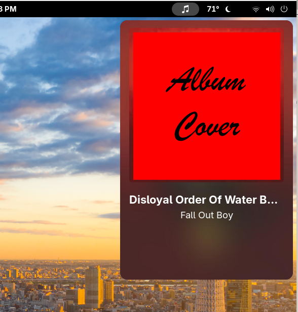

# Dropbeat

Dropbeat is a GNOME shell extension that shows a cool card to control your media player. Supports GNOME 48, 49, and 50.



## Requires

ImageMagick (available in pretty much all distros' official repos)

## Installation

### GNOME Extensions

Recommended method, although updates are sometimes delayed.
You still need to make sure your system has ImageMagick installed yourself.
The extension explains how to do this on most distros.

[](https://extensions.gnome.org/extension/9019/dropbeat/)

### Manual Installation

Guaranteed to be up-to-date, but generally not recommended.
You still need to make sure your system has ImageMagick installed yourself.
The extension explains how to do this on most distros.

```shell
git clone https://github.com/romanlefler/dropbeat.git
cd dropbeat

# Stable branch recommended
git switch stable

make install
```

## Features

- Control your media player from the top bar
- View album art, track title, and artist name
- Play, pause, and skip tracks
- Works with any MPRIS player such as Firefox, Spotify, VLC, etc.
- Click the Album Art to open a fullscreen pop-up
- Configurable global shortcut to toggle open the card

## Current Limitations

- No shuffle, loop, or volume controls
- No seeking controls or progress bar
- Always only shows last active player in the case of multiple players

## Building

Below are various commands to build and test the extension.

Build to `dist/build`:

```shell
make
```

Launch test GNOME shell instance:

```shell
./nest-test
```

Install via Makefile:

```shell
make install
```

Create ZIP file:

```shell
make pack
```

